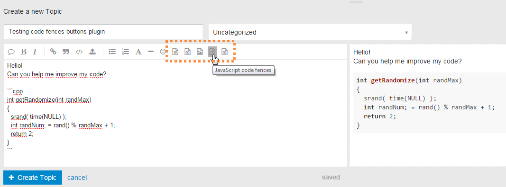
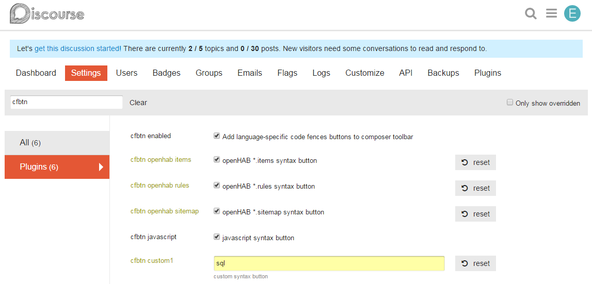

# Discourse Plugin: Code Fences Buttons (cfbtn)

This plugin adds buttons to your Discourse composer toolbar for inserting code fences with language-specific syntax highlighting.

Currently, there are three options implemented:

* Buttons for OpenHAB items, rules and sitemap syntax highlighting
* One button for JavaScript syntax highlighting
* One custom syntax button, can be freely assigned with a language in settings

It's easy to add yet another button to create code fences or whatever you want to paste into the composer window. PRs welcome!

**Usage**  

**Admin Settings**  

## Further information

This plugin is based on another plugin, please have a look for more details:
https://github.com/cpradio/discourse-plugin-spoiler-ui
